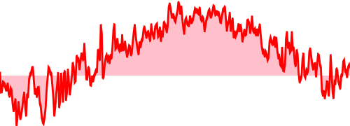

---
Homework Assignment 1: Arrays and Climate
---
**Due: Tuesday, September 19, 2023, midnight**
 
*Note: Homework Assignment 1 should be completed individually.*

This homework will serve several purposes:  first, as a way to ease back into Java programming (if it has been a while for you); second, to give us an idea of your programming habits and training; and third, to investigate various operations that use arrays.  To make the work more interesting, we will write a program to analyze and answer questions about real climate data, such as:

* What was the average temperature over an entire year?  For a given month?
* What were the highest and lowest recorded temperatures?  How about the top or bottom three?
* How many days were above 30 degrees Celsius?
* What was the maximum number of consecutive days above 30 degrees?

You can probably come up with your own set of questions to ask in addition to these.

You can [download the climate data files from NOAA](https://www.ncei.noaa.gov/access/crn/qcdatasets.html).

# Preparing the Code

We don't want to attempt data processing with buggy code, so our first step should be to write and thoroughly test some utility functions that will help us to answer the questions posed above, in addition to others you may have.  The utilities should be designed with generality and re-use in mind, so that they can be as broadly useful as possible.  As always, it's best to start by writing the test cases.  This will help you to think through the problem, as you first design a few general examples and then think about edge cases.

REMEMBER: Put your classes in the [app/src/main/java/a1](https://github.com/SmithCollege/a1-csc210-F23/tree/main/app/src/main/java/a1) directory and your tests in the [app/src/test/java/a1](https://github.com/SmithCollege/a1-csc210-F23/tree/main/app/src/test/java/a1) directory.

For this assignment, you should write all of these methods to work with a plain `float[]` array. Please do not use an `ArrayList` or `IndexAccess` for the time being; the point here is for you to work with the actual underlying storage paradigm as closely as possible.  You can write each of the methods below as a static member of the class `ArrayMethods`, which you will create in [app/src/main/java/a1](https://github.com/SmithCollege/a1-csc210-F23/tree/main/app/src/main/java/a1).  Put your tests in class `ArrayMethodsTest` which you will create in [app/src/test/java/a1](https://github.com/SmithCollege/a1-csc210-F23/tree/main/app/src/test/java/a1).

**Whole Array Sum**: The first method to write will return the sum of all the elements in an array. 
* Method name: `wholeSum`
* Test #1 Input:  `[1.0, 2.0, 3.0, 4.0]` Output: `10.0`
* Test #2 Input: `[-7.5, 3.2]` Output: `-4.3`
* Test #3 Input: `[]` Output: `0.0`
* etc.

Write at least two more test cases of your own, including one with just one array element.

**Partial Array Sum**: For generality, it would be nice to allow specification of two arguments `lo` and `hi` in addition to the array.  These will indicate a range of indices where the sum should be computed; the result should include everything from `arr[lo]` up to `arr[hi-1]`.  Write at least three more test cases in addition to the ones shown below.
* Method name: `sum`
* Test #1 Input:  `[1.0, 2.0, 3.0, 4.0], 1, 3` Output: `5.0`
* Test #2 Input:  `[1.0, 2.0, 3.0, 4.0], 0, 4` Output: `10.0`
* Test #3 Input:  `[1.0, 2.0, 3.0, 4.0], 2, 2` Output: `0.0`
* etc.

Your method may assume that the values given for `lo` and `hi` are valid.  (If they are not, then Java will by default throw an `ArrayIndexOutOfBoundsException`, which is an appropriate response to the situation.)

Once you have defined the general method, it is convenient to use method overloading to add a version that takes just the array as arguments, and calls the general version with `lo` set to `0` and `hi` to `arr.length-1`.  By doing so, you have recreated `wholeSum` as a special case of the general method just defined.  Test this version of `sum` using the same test cases you wrote for `wholeSum`.  Going forward, we will use this same approach to define a general "ranged" version of a function, and a more specialized "unranged" version.

**Array Mean**: Computing the mean is similar to the sum, with an additional step at the end to divide the total by the number of measurements.  In fact, you can use the `sum` method you just wrote as you implement `mean`.  Come up with a set of tests similar to the ones for `sum`.
* Method name: `mean`
* Test #1 Input:  `[1.0, 2.0, 3.0, 4.0], 2, 4` Output: `3.5`
* Test #2 Input:  `[1.0, 2.0, 3.0, 4.0]` Output: `2.5`
* Test # Input:  `[]` Output: `0.0`
* etc.

**Array Minimum** and **Array Maximum**:  These methods will return the smallest (or largest) value found within the specified range (or the entire array, for the unranged version).  Make sure you devise a thorough set of test cases, including at least 3-5 more examples than those shown.  In case of an empty range, the methods should return `Float.NaN`.

* Method name: `min`
* Test #1 Input:  `[1.0, 3.0, 2.0, 4.0], 1, 4` Output: `2.0`
* Test #2 Input:  `[1.0, 3.0, 2.0, 4.0]` Output: `1.0`
* Test #3 Input:  `[]` Output: `Float.NaN`
* etc.

* Method name: `max`
* Test #1 Input:  `[1.0, 3.0, 2.0, 4.0], 1, 4` Output: `4.0`
* Test #2 Input:  `[1.0, 3.0, 2.0]` Output: `3.0`
* Test #3 Input:  `[1.0, 3.0, 2.0], 0, 0` Output: `Float.NaN`
* etc.

**[Stretch] Array Lowest** and **Array Highest**:  This item is a *stretch goal*, meaning that it may be more difficult than other parts of the assignment and is not crucial to completing the rest of the work.  Since they may take more time, and/or be more confusing, we recommend that you hold off on attempting stretch goals until you have completed the rest of the assignment fully. 

Instead of a single smallest or largest value, these methods will return the smallest (or largest) `k` values, where `k` is a parameter to be specified when the method is called.  The results should be returned in a new array of length `k`, and do not need to appear in any particular order.  If the value of `k` is larger than the size of the range, empty values should be filled in with `Float.NaN`.  As usual, please devise a full set of test cases, including examples where values are duplicated.

* Method name: `lowest`
* Test #1 Input:  `[1.0, 3.0, 2.0, 4.0], 0, 4, 2` Output: `[1.0, 2.0]` or `[2.0, 1.0]`
* Test #2 Input:  `[2.0, 3.0, 2.0, 3.0], 0, 4, 3` Output: `[2.0, 2.0, 3.0]` or some other permutation
* Test #3 Input:  `[4.0, 3.0, 2.0, 1.0], 2` Output: `[1.0, 2.0]` or `[2.0, 1.0]`
* Test #4 Input:  `[4.0, 3.0, 2.0, 1.0], 1` Output: `[1.0]`
* Test #5 Input: `[4.0, 3.0], 3` Output: `[4.0, 3.0, Float.NaN]` or some other permutation
* etc.

* Method name: `highest`
* Test #1 Input:  `[1.0, 3.0, 2.0, 4.0], 0, 4, 2` Output: `[3.0, 4.0]` or `[4.0, 3.0]`
* Test #2 Input: `[4.0, 3.0], 3` Output: `[4.0, 3.0, Float.NaN]` or some other permutation
* etc.

# Reading in the Data

Reading data isn't really the focus of the assignment, though it is necessary if we want to apply our program to real numbers.  So that you don't spend a lot of time worrying about the input process, we've provided an example file reader.  For demonstration purposes, all it does it print out the date and temperature fields.  You can modify this code so that it instead stores everything in one or more arrays, ready for additional computation. 

*A note on object-oriented design*:  since each line of the data file represents one day's worth of measurements, and each day has the same set of properties, it would be natural to write a class with fields to hold all these values for a single day.  Your program could then read the file a line at a time, produce an instance of this class from each line, and put them all in an array.  We're deliberately not doing that here, partly to avoid the trouble of handling all those extra fields we won't be using, and partly to put the focus on the use of multiple arrays.  So instead of a single array where each element holds an object with all of a day's values, we're using multiple individual arrays storing the values of one particular measurement over all the days.  The values from a particular day that would have been part of a single object are instead distributed over the multiple arrays, each at the same index location.

For this portion of the assignment, you should write a class `ClimateQueries` with a main method that reads in a file and produces output in the form shown below:

    Source file: YUMA_2023.txt
    Annual mean temperature: 25.6 degrees Celsius
    Minimum average daily temperature: -2.7 degrees Celsius
    Maximum average daily temperature: 37.4 degrees Celsius
    Mean temperature in January: 8.4 degrees Celsius
    Mean temperature in July: 29.8 degrees Celsius

## Missing Data

Some data files have missing values.  These are indicated in the file using the synthetic value `-9999.0`.  Obviously, including a number like this in an average (or minimum) would skew the results.  The best way to handle missing data is a subtle question that we won't delve into here.  However, as a first step towards something more sensible we can at least exclude any missing values from our computations.

One way to do this is to write customized versions of all our methods that include some condition for when to exclude an element.  The disadvantage of this approach is the number of different versions that would be required to anticipate every type of condition one might want to apply.  A more general approach is to introduce _indicator variables_, in this case an array of `boolean` values the same length as the original array.  Each boolean indicates (hence the name) whether the value at the corresponding index is to be included in the comptation or not.  Defining the methods below will begin our exploration of indicator variables.

* Method name: `isEqualTo`
* Test #1 Input:  `[1.0, 2.0, 3.0, 2.0], 2.0` Output: `[false, true, false, true]`
* Test #2 Input:  `[1.0, -9999.0, 3.0, 2.0], -9999.0` Output: `[false, true, false, false]`
* etc.

* Method name: `logicalNot`
* Test #1 Input:  `[false, true, false, false]` Output: `[true, false, true, true]`
* etc.

* Method name: `mean`
* Test #1 Input:  `[1.0, -9999.0, 3.0, 2.0], [true, false, true, true], 0, 4` Output: `2.0`
* etc.
  
# More Complicated Queries

Once we have the concept of an indicator variable, we can use them for a lot of different purposes to create more creative queries.  Add the methods below to your collection, with a set of robust tests.

* Method name: `isGreaterThan`
* Test #1 Input:  `[1.0, 2.0, 3.0, 2.5], 2.5` Output: `[false, false, true, false]`
* etc.

* Method name: `datesBetween`
* Test #1 Input:  `["20230101","20230214","20230704"], "20230201", "20230601"` Output: `[false, true, false]`
* etc.
 
* Method name: `logicalAnd`
* Test #1 Input:  `[false, true, true, false], [false, true, false, true]` Output: `[false, true, false, false]`
* etc.

* Method name: `count`
* Test #1 Input:  `[false, true, true, false, true]` Output: `3`
* etc.

* Method name: `findFirst`
* Test #1 Input:  `[false, false, true, false, true]` Output: `2` 
* Test #2 Input:  `[false, false, false]` Output: `-1`
* etc.

* Method name: `find`
* Test #1 Input:  `[false, true, true, false, true]` Output: `[1, 2, 4]` 
* Test #2 Input:  `[false, false, false]` Output: `[]`
* etc.

Using these you can ask questions like "What was the first date of the year with a temperature above 25 degrees?" or "How many days during the summer had temperatures above 30 degrees?"

## Putting it All Together

Here's a goal that will utilize all the material developed above, and also help to interrogate the progression of climate change in a given location, if any.  Choose a target location of interest to you, with at least 8-10 years of readings.  Process the files and create arrays to store each of the following pieces of information:
* The average daily temperature over the full year
* The first day in each year with an average temperature that exceeds the annual average from the first year of data
* The number of days with temperatures over 30 degrees
  
Now divide the period into a first half and a second half, and compute the average of each of these quantities for both groups.  Does the second half seem warmer than the first?  (Of course, one should do a much more rigorous statistical analysis before drawing any real conclusions.  However, that would go far beyond the scope of this assignment.)

## Graphics Bonus

If you're interested, we offer this completely optional extension to the assignment.  Numerical averages are one way to capture a set of numbers.  On the other hand, visual representations can often give a more visceral feel for what is happening.  If you would like to create images of your arrays, we offer one such option here.  This section is inspired by a [blog post from Alex Plescan](https://alexplescan.com/posts/2023/07/08/easy-svg-sparklines/).

Class `SVG_Spark` contains a method that takes a `float[]` array plus file name and writes an SVG image file with a line plot of the values in the array.  You can use this to visualize trends, etc.

